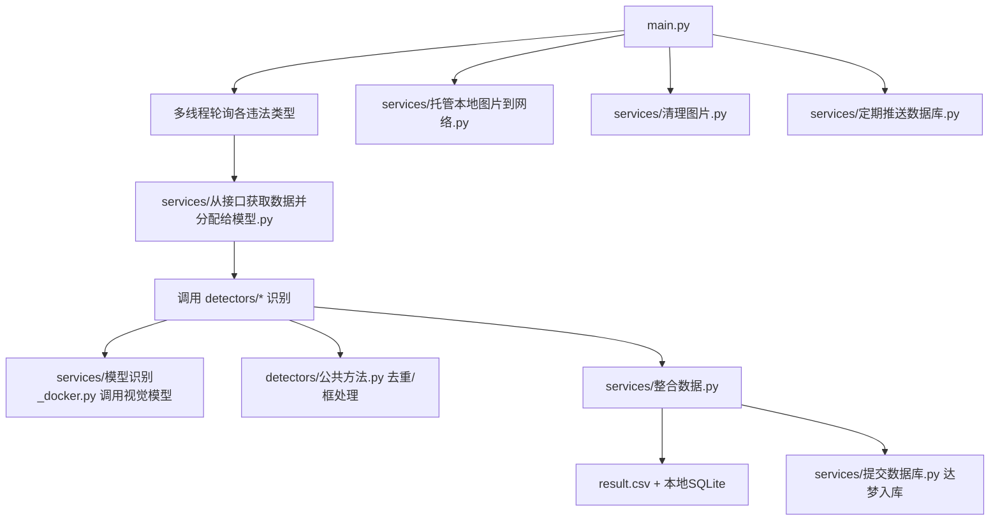

# 公路违法行为识别系统

一个面向公路场景的违法行为识别与线索上报项目。  
主服务负责轮询图片、调用视觉大模型识别、去重与合规过滤、落库和推送；仓库内还包含一个独立的 `clue_ui_sandbox` 可视化线索管理界面。

## 1. 功能概览

- 支持 6 类违法行为识别：
1. 擅自占用、挖掘公路
2. 在公路上及公路用地范围内堆放物品
3. 在公路上及公路用地范围内摆摊设点
4. 遮挡公路附属设施或者利用公路附属设施架设管道、悬挂物品，可能危及公路安全
5. 在公路范围内擅自移动井盖
6. 在公路用地范围内设置公路标志以外的其他标志
- 通过接口批量拉取待识别图片并回传处理状态
- 基于提示词（`prompts/*.txt`）驱动大模型识别
- 支持重复线索抑制（时间窗去重）
- 支持许可库校验（合规场景不报送）
- 支持本地 SQLite 暂存 + 达梦数据库提交
- 内置本地图片托管服务（Flask，端口 `5000`）
- 附带线索管理 UI（Vue + FastAPI）

## 2. 架构与数据流



## 3. 目录结构（核心）

```text
.
├─main.py                         # 服务入口，进程/线程编排
├─config/
│  ├─配置.py                      # 运行配置（路径、接口、模型地址等）
│  ├─数据库配置.py                # 违法类型映射、达梦表结构字段等
│  └─prompts.json                 # 提示词路径映射
├─prompts/                        # 6 类违法行为提示词
├─detectors/                      # 识别逻辑（按行为拆分）
├─services/                       # 采集、调度、推送、入库、图片服务
├─infra/                          # 日志基础设施
├─utils/                          # 配置/路径/日志/提示词加载
├─pic/                            # 图片与数据库挂载目录（运行时）
└─clue_ui_sandbox/                # 独立线索管理前后端项目
```

说明：仓库里还有 `.idea/`、`__pycache__/` 等开发产物目录；`其他文件/` 为非主流程目录。

## 4. 主流程说明

`main.py` 启动后会并行运行：

- 进程 1：图片托管服务（Flask）
- 进程 2：历史图片清理任务（默认清理 `YUANTU_PATH` 中 10 天前文件）
- 进程 3：定时推送任务（默认每日 `01:00`）
- 主线程：3 个轮询线程（高频/中频/低频），每轮每类行为默认 `sleep 60s`

单条数据处理路径：

1. 从图片接口按违法类型拉取待识别记录（`/images`）
2. 读取本地切片图并调用对应 detector
3. 调用视觉模型接口得到 `{"result":"yes/no","bounding_boxes":[...]}` 风格结果
4. 结合规则过滤（尺寸校验、连续帧复核、许可库校验、去重）
5. 保存标框图/原图，回写状态到图片接口（`/feedback`）
6. 线索写入本地结果并按规则提交达梦

## 5. 快速开始

### 5.1 环境建议

- Python 3.9+（推荐 3.10/3.11）
- Linux Docker 运行环境（项目默认路径按容器场景编写）
- 可访问：
1. 图片接口服务（`IMAGE_API`）
2. 视觉模型服务（`LIANTONG_MODEL`）
3. 达梦数据库（可选）

### 5.2 安装依赖（示例）

仓库没有统一 `requirements.txt`（主服务）；按代码依赖至少需要：

- `pandas`
- `requests`
- `Pillow`
- `opencv-python`
- `flask`
- `numpy`
- `dmPython`（达梦提交场景）

### 5.3 启动

```bash
python main.py
```

### 5.4 语法检查

```bash
python -m py_compile main.py config/*.py detectors/*.py services/*.py infra/*.py
```

PowerShell 全量检查：

```powershell
python -m py_compile (Get-ChildItem -Recurse -Filter *.py | % FullName)
```

## 6. 关键配置项（`config/配置.py`）

| 配置项 | 说明 |
|---|---|
| `BASE_URL` | 摄像头平台接口地址 |
| `USER_NAME` / `USER_PWD` | 摄像头平台认证 |
| `LIANTONG_MODEL` | 视觉大模型接口 |
| `MODEL_SERVE_URL` | 备用模型服务地址 |
| `DATA_BASE_PATH` | 容器内数据根目录（默认 `/app/pic`） |
| `YUANTU_PATH` 等 | 各类图片输出目录 |
| `TEMPORARY_RECORD` | 本地临时 SQLite 数据库路径 |
| `IMAGE_API` | 待识别图片拉取/反馈接口地址 |
| `IMAGE_QIEPIAN_PATH` | 本地图片切片目录 |
| `CHONGFU_TIME` | 去重时间窗（小时） |
| `XVKE_DB_CONFIG` | 许可库达梦配置 |

提示词路径由 `config/prompts.json` 管理，对应 `prompts/*.txt`。

## 7. 数据存储与去重策略

- `result.csv`：识别结果汇总备份
- `TEMPORARY_RECORD`（SQLite）：
1. `sixiang_weifa`：四项行为去重与上报判定
2. `wupin_tanwei`：堆放/摆摊连续行为聚合缓存
3. `results`：结构化线索表（含 `model_output`、`is_committed`、`所属支队`）
- `services/整合数据.py` 会根据行为类型触发本地/达梦提交逻辑

## 8. 图片与端口

- 图片托管服务：`http://<host>:5000/preview/<folder>/<filename>`
- 支持预览目录：`yuantu/wupin/baitan/gongbiao/wajue/jinggai/xuangua`

## 9. `clue_ui_sandbox`（独立子项目）

用于线索查询、统计、详情查看和提交操作。

- 后端：FastAPI（`clue_ui_sandbox/backend`）
- 前端：Vue3 + Element Plus + ECharts（`clue_ui_sandbox/frontend`）
- 部署：`clue_ui_sandbox/deploy/docker-compose.yml`
  - 前端映射：`6586 -> 80`
  - 后端映射：`6587 -> 8000`

核心接口：

- `GET /api/clues`
- `GET /api/clues/{id}`
- `POST /api/clues/{id}/commit`
- `GET /api/stats/summary`
- `GET /api/stats/by-violation`
- `GET /api/stats/by-location`
- `GET /api/stats/trend-by-violation`
- `GET /healthz`

提交模式：

- `CLUE_COMMIT_GATEWAY=mock`：仅更新本地 `is_committed=1`
- `CLUE_COMMIT_GATEWAY=dm`：写入达梦

## 10. 开发建议

- 新业务逻辑优先放入 `detectors/` 或 `services/`，避免堆积在 `main.py`
- 保持中文模块名兼容，不随意重命名现有文件
- 对 CSV/DB 字段变更，先做缺字段回退验证
- 提交前至少执行一次递归 `py_compile`

## 11. 安全与生产注意事项

- 当前配置文件中存在明文地址/账号示例，生产环境请改为环境变量注入
- 不要将真实凭据提交到 Git 仓库
- 推送达梦前请确认 `IS_SUBMIT` 与目标表结构一致
- 注意容器挂载路径与代码中的默认路径保持一致（尤其 `/app/pic`、`/app/screenshots`）

---

如果你只想先跑通最小链路：先配置 `IMAGE_API` + `LIANTONG_MODEL` + 图片路径，启动 `python main.py`，确认图片能进入对应违法目录并能通过 `5000/preview` 访问，即可完成端到端冒烟验证。
