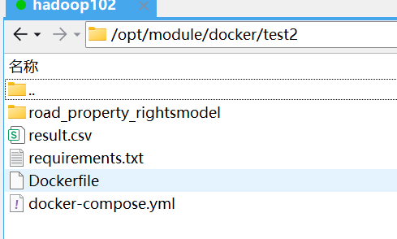

## 1.自己虚拟机目录：
（yml文件可以没有）  
在该目录运行
```
docker build -f Dockerfile.base -t htc/highway_property:base .  （构建环境、依赖）
docker build -f Dockerfile.env -t htc/highway_property:dev . （这个没有）
docker build -f Dockerfile -t htc/highway_property:latest .  （拷贝代码）
```
htc/highway_property是镜像名 250606是标签
## 2.使用 docker save 命令导出镜像到 tar 文件
```docker save -o highway_property_250606.tar htc/highway_property:250606```  
```chmod 777 highway_property_250606.tar``` 修改文件权限
## 3.导入tar文件到目标linux
并运行```docker load -i highway_property_250606.tar``` (要确保当前目录下有tar文件)
## 4.运行容器
将docker-compose.yml 放到/data1/qwen2v/下，并且该目录下要有road_property_rightsmodel 文件夹且里面有模型代码。  
执行```docker compose up -d```以docker-compose.yml方式启动容器，这个命令会根据当前目录下的 docker-compose.yml 文件，启动你定义的所有服务（如多个容器），并在后台运行。  
-d表示后台启动
## 5.停止容器
```docker stop debris-detector```debris-detector是容器名  
```docker rm -f debris-detector``` 删除  
```docker compose restart debris-detector``` 重启容器（但不会重新读取yml配置）
## 6.日志查看

### 1.实时查看日志
```bash
docker logs -f debris-detector
docker logs -f --tail 100 debris-detector
```
- `-f` 表示 *follow*，会实时输出容器的新日志，类似 `tail -f`。

### 2.查看日志并带时间戳
```bash
docker logs -f --timestamps debris-detector
```
- 显示每条日志的生成时间。

### 3.仅查看最新的 100 行日志
```bash
docker logs --tail 100 debris-detector
```

### 4.退出日志查看
在使用 `-f` 模式实时查看时，可以按下：
```
Ctrl + C
```
即可退出日志查看，不会中断容器运行。

### 提示

如果你想过滤日志内容（例如只看特定关键词），可以结合 `grep` 使用：

```bash
docker logs debris-detector | grep "开始轮询"
```
