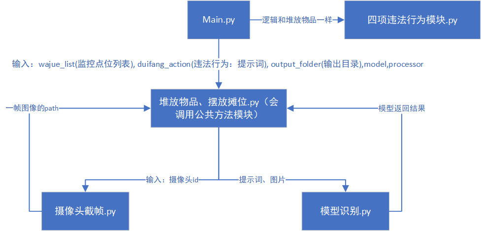

## 1.main.py
主函数:内部定义了
1. 提示词
2. 以及调用违法行为监测模型的方法
3. 另外还要获取摄像头点位字典:会调用获取摄像头点位数据模块获取pd表,然后创建一个updata_dianList,输入违法行为(csv里的),获得点位名称:点位id字典列表,不再使用配置.py里的字典列表,但摆摊堆放物品还没有依然从配置.py里获取
## 2.模型识别.py
调用另一个docker的大模型，只需要post请求到"http://htc-qwen2vl:8000/generate"地址即可
## 3.清理图片.py
会一天定期清理yuantu文件夹里的图片（一个月之前的图片），会在main.py里开启一个守护进程
```python
    # 开启删除图片进程
    clear_process = multiprocessing.Process(target=clear_begin, name="ClearImg")#clear_begin(会阻塞主进程)
    clear_process.daemon = True
    clear_process.start()
```
## 4.堆放物品_摆设摊位.py 四项违法行为识别.py
违法行为识别逻辑：
### 1.堆放物品_摆设摊位
检测出违法行为后，会从临时数据库查找4-24小时的、同样监控点位、同样违法行为、同样框位置的行为（并集），若存在，统一提交到数据库，并删除原临时数据库内容，若无，则放入临时表，不上传数据库
### 2.四项违法行为识别
检测出违法行为后，会从临时数据库查找8小时内的、同样监控点位、同样违法行为（并集），若有，则不提交数据库；若无，则提交数据库、并放到临时数据库

## 5.获取摄像头点位数据.py
该模块首先读取./data里的视频点位确认表,然后根据里面的点位去获取对应的camera_id,然后根据所属支队去数据库配置.py找对应地区编码,整合成新的csv表格并存储.  
在开始会判断该csv是否存在,若存在就直接读取,并返回pd,不存在就创建

## 6.数据库配置.py
用于配置太极数据库对接的字段

## 7.提交数据库.py
提交数据库到太极

## 8.my_logger.py
并行运行：打印日志模块，每天打印日志到./logs文件夹，保存7天内的日志


